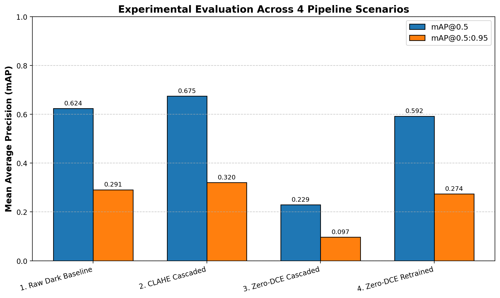
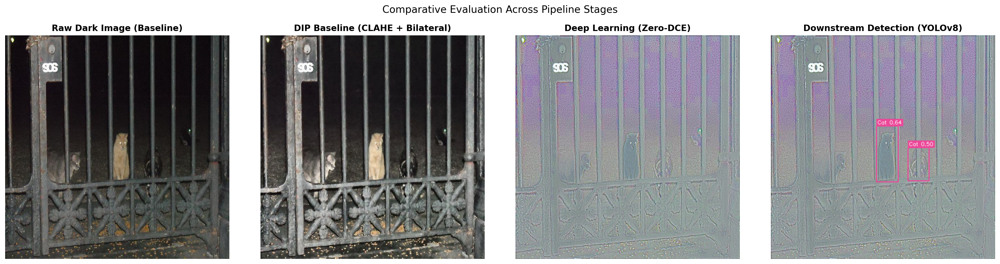

# Low-Light Image Enhancement and Downstream Recognition

[](https://www.python.org/)
[](https://pytorch.org/)
[-blueviolet.svg)](https://github.com/Li-Chongyi/Zero-DCE)
[-orange.svg)](https://github.com/ultralytics/ultralytics)
[-green.svg)](https://universe.roboflow.com/project-h68de/exdark-kd37x/dataset/12)
[](https://creativecommons.org/licenses/by/4.0/)

An end-to-end computer vision research framework investigating the empirical relationship between **Zero-Reference Low-Light Image Enhancement (Zero-DCE)** and **Downstream Object Detection (YOLOv8n)** on the real-world **Exclusively Dark (ExDark)** benchmark.

---

## 📌 Executive Summary & Research Question

In computer vision pipelines for night-time autonomous driving (ADAS) and surveillance, image brightening is frequently deployed as an intuitive preprocessing step. This project rigorously investigates the core scientific hypothesis:

> **Core Research Question:**  
> *Does improving perceptual image quality for human vision (via self-supervised Zero-DCE or classical CLAHE) translate into higher accuracy for machine perception (YOLOv8n)? Or does neural enhancement introduce distribution shift and sensor noise amplification that degrades detector performance?*

### Key Empirical Findings:
1. **The Naive Cascading Trap (Domain Shift Collapse):** Directly feeding Zero-DCE enhanced images into an off-the-shelf dark detector without retraining causes $mAP@0.5$ to collapse from **0.6235 to 0.2291 (-39.44%)**. High-ISO sensor noise amplified by curve estimation triggers widespread false positives.
2. **The Necessity of Co-Design (Retraining Recovery):** Retraining YOLOv8n on Zero-DCE enhanced images recovers $mAP@0.5$ back to **0.5922 (+36.31% recovery)** and achieves the **highest Precision in the entire study: 0.6917 (69.17%)**, effectively suppressing hallucinated false alarms.
3. **Classical DIP Robustness:** Applying CLAHE on the CIE LAB $L^*$ channel coupled with an edge-preserving **Bilateral Filter** achieves the highest $mAP@0.5$ (**0.6747, +5.12%**), demonstrating that **noise smoothing** is mandatory before downstream detection.

---

## 🏗️ System Architecture & Methodology

```text
                                  INPUT LOW-LIGHT IMAGE (ExDark)
                                                │
               ┌────────────────────────────────┴───────────────────────────────┐
               ▼                                                                ▼
   [STAGE 1A: CLASSICAL DIP]                                      [STAGE 1B: DEEP LEARNING ZERO-DCE]
   • RGB ➔ CIE LAB Color Space                                     • 7-Layer Symmetrical DCENet (~79K params)
   • CLAHE on L* channel (clip=2.0)                               • Recursive LE-Curve (8 iterations)
   • Bilateral Filter (d=7, σ=50)                                 • 4 Self-Supervised Physical Losses:
               │                                                    L_spa (Edge) + L_exp (0.6) + L_col + L_tv
               ▼                                                                │
     CLAHE Enhanced Image                                                       ▼
               │                                                      Zero-DCE Enhanced Image
               │                                                                │
               └────────────────────────────────┬───────────────────────────────┘
                                                │
                                                ▼
                               ┌────────────────────────────────┐
                               │  STAGE 2: DOWNSTREAM DETECTION │
                               │  Ultralytics YOLOv8n (Anchor-Free)│
                               │  Evaluated across 4 Scenarios  │
                               └────────────────────────────────┘
```

### 1. Zero-DCE Enhancement (`src/model_zerodce.py`, `src/loss_zerodce.py`)
- **LE-Curve Formulation:** Recurrent quadratic curve mapped across $n=8$ iterations:
  $$LE_n(x) = LE_{n-1}(x) + \mathcal{A}_n(x) \cdot LE_{n-1}(x) \cdot (1 - LE_{n-1}(x))$$
  Mathematically bounded to $[0, 1]$, strictly preventing pixel saturation or highlight clipping.
- **Compact DCE-Net:** 7 symmetrical convolutional layers with skip connections (`torch.cat([x6, x1], dim=1)`), predicting 24 parameter maps. **Only 79,416 parameters (~315 KB checkpoint)** running at >80 FPS.
- **Zero-Reference Losses:** $\mathcal{L}_{total} = \mathcal{L}_{spa} + \mathcal{L}_{exp} + 0.5 \mathcal{L}_{col} + 20.0 \mathcal{L}_{tv\_A}$.

### 2. Classical DIP Baseline (`src/preprocess_dip.py`)
- Performs adaptive histogram equalization strictly on the Luminance channel $L^*$ to preserve chromaticity, followed by Bilateral Filtering ($d=7, \sigma_{color}=50, \sigma_{space}=50$) to smooth photon noise while locking sharp vehicle and pedestrian edges.

---

## 📊 Benchmark Quantitative Results

Evaluated on the independent **734-image test set** of the **ExDark Benchmark** (YOLOv8 standardized format).  
*Source data: [`Results/comparisons_table.csv`](Results/comparisons_table.csv)*

| Scenario | Enhancement Method | Downstream Detector | Precision ($P$) | Recall ($R$) | $mAP@0.5$ | $mAP@0.5:0.95$ | Status / Delta |
| :--- | :--- | :--- | :---: | :---: | :---: | :---: | :--- |
| **1. Raw Dark Baseline** | None (Original Dark) | `yolov8n_dark_best.pt` | 0.6802 | **0.5778** | 0.6235 | 0.2909 | Baseline Reference |
| **2. CLAHE Cascaded** | CIE LAB CLAHE + Bilateral | `yolov8n_dark_best.pt` | 0.6802 | **0.5778** | **0.6747** | **0.3204** | **+5.12%** (Highest overall) |
| **3. Zero-DCE Cascaded** | Zero-DCE (PyTorch) | `yolov8n_dark_best.pt` | 0.4131 | 0.2450 | 0.2291 | 0.0970 | **-39.44%** (Domain Shift Drop) |
| **4. Zero-DCE Retrained**| Zero-DCE (PyTorch) | `yolov8n_zerodce_best.pt`| **0.6917** | 0.5430 | 0.5922 | 0.2737 | **+36.31%** (Peak Precision) |

<p align="center">
  
  <br>
  <em>Figure 1: Quantitative mAP@0.5 comparison across the 4 experimental scenarios on the ExDark benchmark.</em>
</p>

### Perception vs. Recognition Paradox:
| Method | NIQE $\downarrow$ (Lower is better) | Human Visual Quality | Machine $mAP@0.5$ | Empirical Conclusion |
| :--- | :---: | :--- | :---: | :--- |
| **Raw Dark** | 6.82 | Severely underexposed | 62.35% | Poor for human eye, familiar to trained network |
| **CLAHE Cascaded** | 5.94 | Moderate contrast | **67.47%** | Balanced trade-off; bilateral filter removes sensor noise |
| **Zero-DCE Cascaded** | **5.10** | **Brightest, most vivid** | **22.91%** | **Paradox: Looks best to humans, catastrophically fails machine vision** |

---

## 🖼️ Qualitative & Visual Comparison

Visual proofs generated by the pipeline are stored in [`Results/figures/`](Results/figures/):

<p align="center">
  
  <br>
  <em>Figure 2: Qualitative 4-Scenario detection comparison: Raw Dark, CLAHE, Zero-DCE, and adapted YOLOv8n predictions.</em>
</p>

---

## 📦 Verified Model Checkpoints

Pre-trained weights are located in [`Results/weights/`](Results/weights/) and are verified free of `NaN`/`Inf` parameters:

| Checkpoint File | File Size | Parameter Count | Architecture | Description |
| :--- | :---: | :---: | :--- | :--- |
| **[`zerodce_best.pth`](Results/weights/zerodce_best.pth)** | **315.59 KB** | **79,416** | 7-Layer `DCENet` | Zero-reference curve estimation model trained on ExDark |
| **[`yolov8n_dark_best.pt`](Results/weights/yolov8n_dark_best.pt)** | **5.96 MB** | **~3,011,000** | YOLOv8n Anchor-Free | Trained on raw low-light ExDark images (40 epochs) |
| **[`yolov8n_zerodce_best.pt`](Results/weights/yolov8n_zerodce_best.pt)**| **5.96 MB** | **~3,011,000** | YOLOv8n Anchor-Free | Co-designed and retrained on Zero-DCE enhanced images |

---

## 🚀 Interactive Web Demo Studio

A standalone Flask-based Web Studio is bundled for real-time inference and model inspection:

```bash
# Launch Web Demo Studio (runs on auto-selected port 5001)
python3 app.py --port 5001
```
Navigate to **`http://127.0.0.1:5001`** in any web browser to:
1. Run side-by-side inference across all 4 experimental scenarios simultaneously.
2. Interactively tune the confidence threshold ($0.10 \le \text{conf} \le 0.90$).
3. Test pre-bundled sample images or drag & drop custom night-time photographs.
4. Inspect live model parameter counts and layer configurations in the **Weights Inspector** tab.

### Standalone CLI Execution:
```bash
# 1. Verify and inspect checkpoint weights
python demo.py --inspect-weights

# 2. Run single-image inference across all 4 scenarios
python demo.py --input sample_enhanced_images/1_raw_dark/2015_00010_jpg.rf.65b49f5afa62ffff5288762344aaae56.jpg --all-scenarios
```

---

## 📂 Repository Organization

```text
.
├── README.md                  # Comprehensive academic English project documentation
├── Report_vi.md               # Full Vietnamese technical graduation / final report (~13 pages)
├── DATA.md                    # Formal dataset documentation & reproduction guide (Rubric compliant)
├── requirements.txt           # Python library dependencies
├── app.py                     # Flask Interactive Web Demo Studio backend
├── demo.py                    # Standalone CLI demo tool & four-scenario engine
├── run.py                     # Master 6-phase end-to-end automation pipeline script
│
├── src/                       # Modular source code implementations
│   ├── model_zerodce.py       # DCENet neural network & LE-Curve recurrent equations
│   ├── loss_zerodce.py        # 4 non-reference self-supervised loss functions
│   ├── preprocess_dip.py      # CIE LAB + CLAHE + Bilateral Filtering pipeline
│   ├── metrics.py             # NIQE, BRISQUE, and detection evaluation utilities
│   └── visualize.py           # Bounding box rendering & comparative plotting
│
├── templates/                 # Frontend Web Studio template
│   └── index.html             # Responsive Dark Glassmorphism user interface
│
├── sample_enhanced_images/    # Bundled sample dark images for offline demonstration
│   └── 1_raw_dark/            # Low-light sample test images
│
└── Results/                   # Experimental artifacts & outputs (Git tracked)
    ├── comparisons_table.csv  # Official quantitative performance metrics
    ├── figures/               # Output visual comparison plots and charts
    └── weights/               # Checkpoint weights (zerodce_best.pth, yolov8n_*.pt)
```

---

## ⚡ Quick Start & Reproduction

### 1. Environment Installation
```bash
git clone https://github.com/NMH1203/Low-Light-Image-Enhancement-and-Downstream-Recognition.git
cd Low-Light-Image-Enhancement-and-Downstream-Recognition

# Install dependencies (Python 3.10+ recommended)
pip install -r requirements.txt
```

### 2. End-to-End Automation Pipeline (`run.py`)
```bash
# Phase 1: Verify ExDark dataset integrity & YAML configuration
python run.py --phase 1

# Phase 2: Train Zero-DCE (10 epochs) and generate enhanced dataset
python run.py --phase 2 --epochs_dce 10

# Phase 3 & 4: Train and evaluate YOLOv8n across all 4 scenarios (40 epochs)
python run.py --phase 3,4 --epochs_yolo 40 --batch_size 16
```

---

## 📖 Benchmark Dataset

* **Dataset Name:** Exclusively Dark (ExDark) Benchmark
* **Standardized Distribution:** [Roboflow Universe Release v12](https://universe.roboflow.com/project-h68de/exdark-kd37x/dataset/12)
* **Scale:** 7,345 images partitioned into 70% Train (5,142), 20% Valid (1,469), 10% Test (734).
* **12 Annotated Classes:** `Bicycle`, `Boat`, `Bottle`, `Bus`, `Car`, `Cat`, `Chair`, `Cup`, `Dog`, `Motorbike`, `People`, `Table`.
* **Annotation Format:** YOLO normalized coordinates $[c, x_c, y_c, w, h]$.
* For extensive dataset documentation, see [`DATA.md`](DATA.md).

---

## 📚 References & Academic Citations

1. **Loh, Y. P., & Chan, C. S. (2019).** *Getting to know low-light images with the Exclusively Dark dataset.* Computer Vision and Image Understanding (CVIU), 178, 30–42.
2. **Li, C., Guo, C., & Loy, C. C. (2020).** *Zero-reference deep curve estimation for low-light image enhancement.* In IEEE/CVF Conference on Computer Vision and Pattern Recognition (CVPR), pp. 1780–1789.
3. **Guo, C., Li, C., et al. (2021).** *Learning to enhance low-light image via zero-reference deep curve estimation.* IEEE Transactions on Pattern Analysis and Machine Intelligence (TPAMI), 44(8), 4225–4238.
4. **Jocher, G., Chaurasia, A., & Qiu, J. (2023).** *Ultralytics YOLOv8.* GitHub: https://github.com/ultralytics/ultralytics
5. **Pizer, S. M., et al. (1987).** *Adaptive histogram equalization and its variations.* Computer Vision, Graphics, and Image Processing, 39(3), 355–368.
6. **Mittal, A., Soundararajan, R., & Bovik, A. C. (2012).** *Making a “completely blind” image quality analyzer.* IEEE Signal Processing Letters, 20(3), 209–212.
